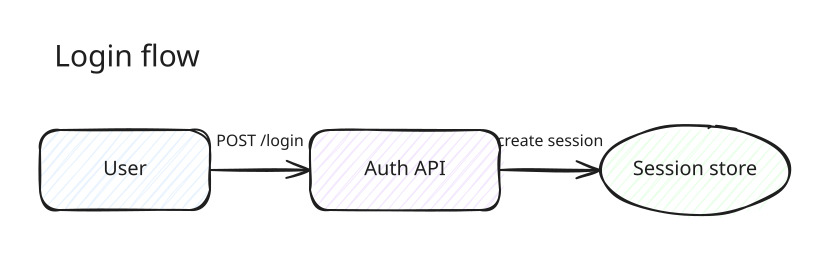

# Excalidraw Diagram Skill

Turn natural-language diagram requests into hand-drawn SVG previews and editable
`.excalidraw` files.

This repository is both:

- a Codex skill that teaches an agent how to design clear Excalidraw diagrams; and
- a small, deterministic CLI that converts compact JSON scene specs into real
  Excalidraw scenes.



## Highlights

- Editable Excalidraw primitives: rectangles, ellipses, diamonds, arrows, lines,
  text, and frames
- Official SVG rendering through Excalidraw's `exportToSvg`
- Excalifont by default, with sensible hand-drawn styling
- Stable element IDs and deterministic seeds
- Automatic shape-label fitting and arrow-to-shape connections
- Lightweight fallback SVG renderer for constrained environments
- No Python packages required

## Install as a Codex skill

Prerequisites: Python 3.10+, Node.js 18+, npm, and Git.

```bash
git clone https://github.com/iruochen/excalidraw-diagram-skill.git \
  ~/.codex/skills/generate-excalidraw
cd ~/.codex/skills/generate-excalidraw
npm ci
```

Restart Codex if it is already running. Then ask:

```text
Use $generate-excalidraw to draw a checkout architecture diagram.
```

The skill returns an SVG preview by default. Ask for an "editable Excalidraw
file" to receive the `.excalidraw` source as the primary artifact.

## Use the CLI

Create a compact scene spec:

```json
{
  "title": "Login flow",
  "elements": [
    {
      "id": "user",
      "kind": "rectangle",
      "x": 80,
      "y": 100,
      "width": 160,
      "height": 70,
      "text": "User"
    },
    {
      "id": "api",
      "kind": "rectangle",
      "x": 360,
      "y": 100,
      "width": 180,
      "height": 70,
      "text": "API"
    },
    {
      "kind": "arrow",
      "from": "user",
      "to": "api",
      "text": "POST /login"
    }
  ]
}
```

Generate the editable scene and official SVG preview:

```bash
python3 scripts/build_excalidraw.py \
  examples/login-flow.scene.json \
  examples/login-flow.excalidraw \
  --svg examples/login-flow.svg \
  --pretty
```

Open the `.excalidraw` file at [excalidraw.com](https://excalidraw.com/) or in a
compatible editor.

For the full scene schema, styling fields, label controls, and examples, see
[references/scene-spec.md](references/scene-spec.md).

## How it works

1. The agent converts a diagram request into a compact semantic scene spec.
2. `build_excalidraw.py` expands the spec into valid Excalidraw JSON.
3. `export_official_svg.mjs` loads Excalidraw in a small JSDOM environment and
   calls the official exporter.
4. The agent visually checks the preview before delivery.

Use `--simple-svg` only when the official exporter cannot run:

```bash
python3 scripts/build_excalidraw.py input.scene.json output.excalidraw \
  --svg output.svg --simple-svg
```

## Development

```bash
npm ci
npm test
npm run example
```

Please read [CONTRIBUTING.md](CONTRIBUTING.md) before opening a pull request.

## License

[MIT](LICENSE). This project is independent and is not affiliated with or
endorsed by Excalidraw.
